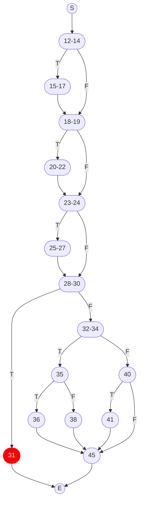

# Control Flow and Logic Analysis for Testing

## Control Flow Graphs (CFGs)

1. The control flow graph (CFG) for the [`Triangle.classify`](../code/lib/src/main/java/uk/ac/shef/com3529/Triangle.java) method:
   


## Branch and Path Coverage

```java
    @Test
    public void shouldSatisfyBranchCoverageInMisc() {
        assertEquals(0, misc(0, 0, 0));
        assertEquals(50, misc(1, 1, 1));
    }

    @Test
    public void shouldSatisfyPathCoverageInMisc() {
        assertEquals(0, misc(0, 0, 0));
        assertEquals(10, misc(1, 0, 0));
        assertEquals(40, misc(1, 1, 0));
        assertEquals(50, misc(1, 1, 1));
        assertEquals(40, misc(0, 1, 0));
        assertEquals(50, misc(0, 1, 1));
        assertEquals(50, misc(0, 0, 1));
        assertEquals(50, misc(1, 1, 1));
    }

    @Test
    public void shouldSatisfyBranchCoverageInGCD() {
        assertEquals(7, gcd(14, 21));
    }

    @Test
    public void shouldSatisfyPathCoverageInGCDWithTwoLoopIterations() {
        // Because the method contains a loop, it is not possible to satisfy path coverage in general
        // But it is possible if we define a bound, e.g., set the number of loop iterations to two
        assertEquals(1, gcd(1, 1)); // does not enter loop
        assertEquals(2, gcd(4, 2)); // enters loop once; if-branch
        assertEquals(2, gcd(2, 4)); // enters loop once; else-branch
        assertEquals(2, gcd(6, 2)); // enters loop twice; if-branch -> if-branch
        assertEquals(2, gcd(6, 4)); // enters loop twice; if-branch -> else-branch
        assertEquals(2, gcd(2, 6)); // enters loop twice; else-branch -> else-branch
        assertEquals(2, gcd(4, 6)); // enters loop twice; else-branch -> if-branch
    }
```

## Logic Analysis and Testing


The code segment that returns when a triangle is isosceles could be re-written as:

```java
if ((side1 + side2 > side3) &&
      (side1 == side2 || side2 == side3) &&
      (side1 != side2 || slide2 != side3)) {
    return Type.ISOCELES;
}
```

1. Conditions in the predicate:

<center>

| ID  | Condition | Conjunct |
| --- | --------- | --------: |
| C1  | side1 + side2 \> side3 | 1 |
| C2  | side1 == side2         | 2 |
| C3  | side2 == side3         | 2 |
| C4  | side1 != side2         | 3 |
| C5  | side2 != side3         | 3 |

</center>

Since C2 is equivalent to C4, and C3 is equivalent to C5, we ignore C4
and C5.

2. The complete multiple condition table is:

<center>

| ID | Condition C1 | Condition C2 | Condition C3 | Branch Predicate |
| --- | -------- | ------ | ------- |------- |
| 1   | T    | T    | T   | F  |
| 2   | T    | T    | F   | T  |
| 3   | T    | F    | T   | T  |
| 4   | T    | F    | F   | F  |
| 5   | F    | T    | T   | F  |
| 6   | F    | T    | F   | F  |
| 7   | F    | F    | T   | F  |
| 8   | F    | F    | F   | F  |

</center>

- C1 is major if we consider ID2 and ID6 or ID3 and ID7
- C2 is major if we consider ID2 and ID4 or ID1 and ID3
- C3 is major if we consider ID1 and ID2 or ID3 and ID4

3. To achieve **Restricted MCDC**

<center>

| ID  |  C1 |  C2 |  C3 | Branch predicate | Input side1 | Input side2 | Input side3 |
| ---:| --- | --- | --- | :--------------: | ----------: | ----------: | ----------: |
|   1 |   T |   T | T   |       F          |      3      |       3     |           3 |
|   2 |   T |   T | F   |       T          |      3      |       3     |           4 |
|   4 |   T |   F | F   |       F          |      3      |       4     |           5 |
|   6 |   F |   T | F   |       F          |      1      |       1     |           5 |

</center>

4. To achieve **Correlated MCDC** we only need tests ID3 and ID6

<center>

| ID  |  C1 |  C2 |  C3 | Branch predicate | Input side1 | Input side2 | Input side3 |
| ---:| --- | --- | --- | :--------------: | ----------: | ----------: | ----------: |
|   3 |   T |   F | T   |       T          |      3      |       4     |           4 |
|   6 |   F |   T | F   |       F          |      1      |       1     |           5 |

</center>

5. The JUnit test suite would look like this:

```java
package uk.ac.shef.com3529;

import org.junit.jupiter.api.Test;

import static org.junit.jupiter.api.Assertions.assertEquals;
import static org.junit.jupiter.api.Assertions.assertNotEquals;

public class TriangleMCDCTest {

    @Test
    public void shouldClassifyIsoceles() {
        // MCDC test requirement ID 3
        Triangle.Type result = Triangle.classify(3, 4, 4);
        assertEquals(Triangle.Type.ISOSCELES, result);
    }

    @Test
    public void shouldNotClassifyIsoceles() {
        // MCDC test requirement ID 6
        Triangle.Type result = Triangle.classify(1, 1, 5);
        assertNotEquals(Triangle.Type.ISOSCELES, result);
    }

}
```

When executing these tests against the `Triangle` class, the second test crashes with the following exception:

```
uk.ac.shef.com3529.InvalidTriangleException: (1, 1, 5) is not a valid triangle
 at uk.ac.shef.com3529.Triangle.classify(Triangle.java:31)
 at uk.ac.shef.com3529.TriangleMCDCTest.shouldClassifyIsocelesWhenSidesAreOutOfOrder(TriangleMCDCTest.java:21)
 at java.base/java.util.ArrayList.forEach(ArrayList.java:1541)
 at java.base/java.util.ArrayList.forEach(ArrayList.java:1541)
```

This indicates that while the test requirement in theory helps us satisfy correlated MCDC, in practice, it is not possible to execute the branch predicate as expected, because the combination of input values needed are handled elsewhere in the code, i.e., line 31 in `Triangle.java`.